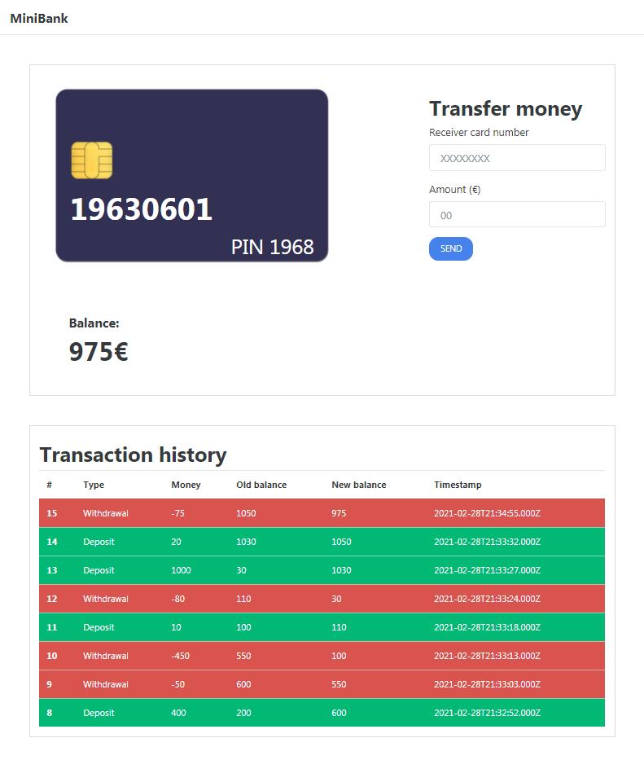

## A simple bank CLIENT+API with Node.JS, Express and MySQL

### Client
An HTML, CSS, Javascript with Bootstrap client.
The balance and transactions get updated in real-time.
Located at `/client`



### Backend
The server is built with Node.JS with Express and MySQL.
##### API
POST `/payments` Validate card
```
SENT

{
	"card":"12345678",
    "pin": 1234
}
```
```
RESPONSES

{
    "ok": true,
    "balance": 2
}

{
    "ok": false,
    "msg": "Wrong card details"
}

```

POST `/register` Create new card
```
RESPONSE

{
    "ok": true,
    "msg": "Card created",
    "card": "65509621",
    "pin": "3123"
}
```


POST `/payments/deposit` Transfer money
```
SENT
{
	"card":"12345678",
    "pin": 1234,
    "targetCard":"12345678",
    "amount": 100
}
```
```
RESPONSE

{
    "ok": true,
    "msg": "Deposit suceeded"
}

{
    "ok": false,
    "msg": "Insufficient funds"
}
```

POST `/payments/withdraw` Make payment
```
SENT

{
	"card":"12345678",
    "pin": 1234,
    "amount": 100
}
```
```
RESPONSE

{
    "ok": true,
    "msg": "Payment suceeded"
}
```

POST `/transactions` Make payment
```
SENT

{
	"card":"12345678",
    "pin": 1234
}
```
```
RESPONSE

{
    "ok": true,
    "transactions": [
        {
            "id": 116,
            "card": "12345678",
            "amount": -1,
            "old_balance": 2,
            "new_balance": 1,
            "time": "2021-03-01T10:59:38.000Z"
        },
        {
            "id": 115,
            "card": "12345678",
            "amount": 1,
            "old_balance": 1,
            "new_balance": 2,
            "time": "2021-03-01T10:56:15.000Z"
        },
        {
            "id": 114,
            "card": "12345678",
            "amount": -1,
            "old_balance": 2,
            "new_balance": 1,
            "time": "2021-03-01T10:56:15.000Z"
        },
        {
            "id": 113,
            "card": "12345678",
            "amount": -12,
            "old_balance": 14,
            "new_balance": 2,
            "time": "2021-03-01T10:09:05.000Z"
        }
    ]
}
```
